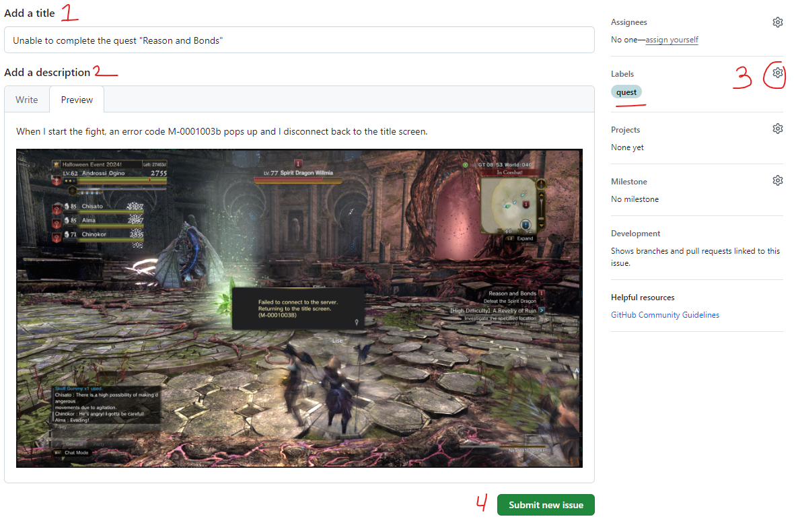

# DDON_Bugs

The main purpose of this repository is to track bugs and issues found while playing on the DDON server hosted at `ddon.org`.

## Creating a new issue

1. At the top of this repository, [click on the Issues button](https://github.com/Dixdros/DDON_Bugs/issues).
    - This is how you navigate to the issues view.
2. Before filing a new issue, first check to see if there are any similar bugs already opened.
    - You can search existing issues by using the search bar and filters.
3. If you have determined that no existing issues match what you are interested in then press the `New Issue` button.

Suppose I wanted to file a new issue for a bug related to a quest.

1. In the `Title` field, add a short but clear description about what the issue is about.
    - Example: Unable to complete the quest "Reason and Bonds"
2. In the description, try to provide clear details on how you arrived at this state.
    - Were you playing alone or in a party with other players
    - Did someone disconnect or was the leader changed
    - If an error code comes up, mention the error code
    - If the issue is related to enemyspawn/key monsters or gathering, provide a screenshot of the current location in the ingame map.
    - If you recorded video when this issue occured, sharing that video can be helpful.
3. Use the labels on the right side of the UI to tag the issue.
    - Example: For the issue with the quest "Reason and Bonds", we should use the `quest` label.
4. Finally, press the `Submit new issue` button to create the issue.

